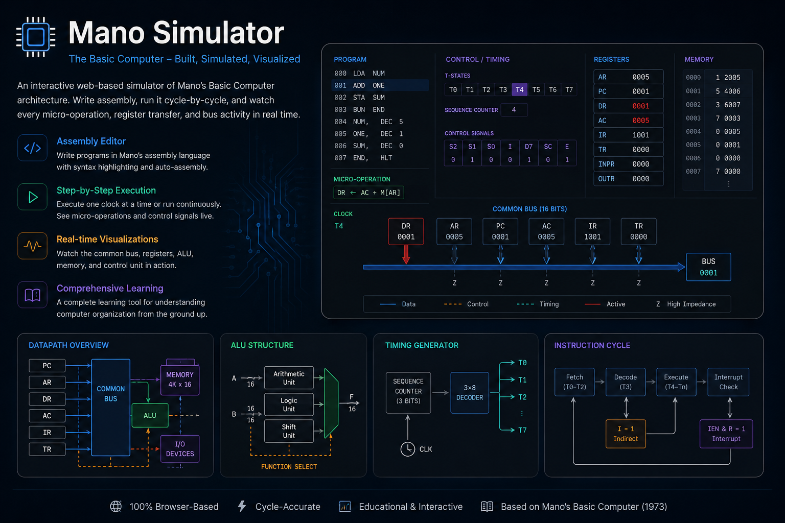
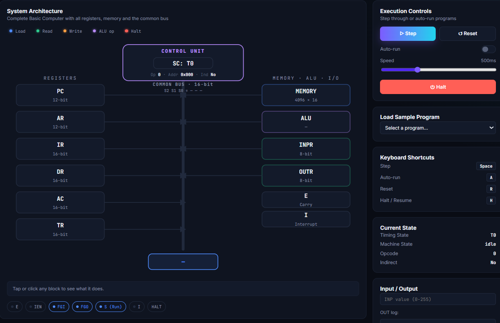
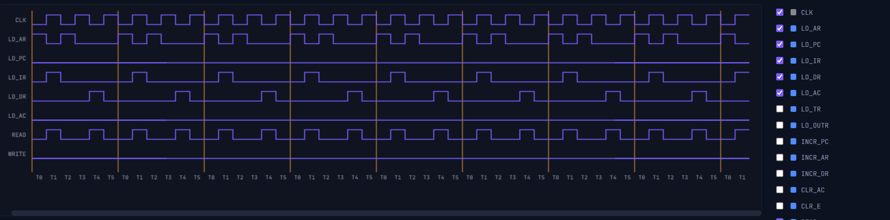

# ManoVision — Morris Mano's Basic Computer, Simulated (C implementation)



A complete implementation of **Morris Mano's Basic Computer** in C — modular architecture, a built-in two-pass assembler, an interactive shell (REPL), and a JSON trace output for step-by-step, micro-operation-level visualization.

This project models the same core hardware organization used by the web-based simulator: 8 registers, 4096 × 16-bit memory, a common bus, and a control unit driven by opcode and T-state sequencing.

<p align="center">
  <a href="https://mohsensafari83.github.io/Mano-Vision/"></a>
  
  
  
</p>

<p align="center">
  <a href="https://mohsensafari83.github.io/Mano-Vision/">🌐 Live Simulator</a> •
  <a href="#2-internal-architecture">Architecture</a> •
  <a href="#6-assembly-language">Assembly Language</a> •
  <a href="#7-instruction-set">Instruction Set</a> •
  <a href="#8-full-examples">Examples</a> •
  <a href="#9-trace-output-format-json">Trace Format</a> •
  <a href="#10-known-issues-and-limitations">Known Limitations</a>
</p>

> **Try it online:** the web-based visualizer — built on the same hardware model described in this README — is live on GitHub Pages: [Visualize the Mano Basic
> Computer](**https://mohsensafari83.github.io/Mano-Vision/**)

### Individual Modules

<p align="center">
  
</p>

_Explore individual components such as registers, ALU, memory, bus, and control unit._

### System Architecture

<p align="center">
  
</p>

_The complete Basic Computer architecture, including registers, common bus, ALU, memory, and I/O._

### Signal Oscilloscope

<p align="center">
  
</p>
The Signal Oscilloscope visualizes control signals and internal activity
across T-states, making the micro-operation sequence of each instruction
easy to inspect.
---

## Table of contents

1. [Project structure](#1-project-structure)
2. [Internal architecture](#2-internal-architecture)
3. [Building](#3-building)
4. [Running](#4-running)
5. [Interactive shell commands](#5-interactive-shell-commands)
6. [Assembly language](#6-assembly-language)
7. [Instruction set](#7-instruction-set)
8. [Full examples](#8-full-examples)
9. [Trace output format (JSON)](#9-trace-output-format-json)
10. [Known issues and limitations](#10-known-issues-and-limitations)
11. [Ideas for future work](#11-ideas-for-future-work)

---

## 1. Project structure

```
Mano-Vision/
├── assets/          # Screenshots and visual assets
├── css/             # Stylesheets
├── docs/            # Architecture and documentation
├── examples/        # Mano Basic Computer programs
├── js/              # Web simulator implementation
├── simulator/       # C implementation
│   ├── include/     # Header files
│   └── src/         # C source files
├── index.html
├── Makefile
└── README.md
```

### File-to-textbook-chapter mapping

| File           | Conceptual equivalent in Mano's architecture                                      |
| -------------- | --------------------------------------------------------------------------------- |
| `mano_types.h` | Register, flag, and control-signal definitions (Ch. 4 & 5)                        |
| `bus.c`        | Common Bus — Ch. 4                                                                |
| `memory.c`     | `M[AR]` — memory transfer — Ch. 4                                                 |
| `alu.c`        | Arithmetic/logic/shift micro-operations — Ch. 4                                   |
| `control.c`    | Control unit, T-state generation, decode, instruction execution — Ch. 5           |
| `state.c`      | Sequence Counter and decode helpers (`get_opcode`, `get_indirect`, `get_address`) |

---

## 2. Internal architecture

### Registers (`Registers`)

| Register        | Width                            | Role                                                                                                                                   |
| --------------- | -------------------------------- | -------------------------------------------------------------------------------------------------------------------------------------- |
| `AC`            | 16 bits                          | Main accumulator                                                                                                                       |
| `AR`            | 12 bits (stored in a `uint16_t`) | Address register                                                                                                                       |
| `PC`            | 12 bits                          | Program counter                                                                                                                        |
| `IR`            | 16 bits                          | Instruction register                                                                                                                   |
| `DR`            | 16 bits                          | Data register                                                                                                                          |
| `TR`            | 16 bits                          | Temporary register                                                                                                                     |
| `SC`            | —                                | Sequence counter (not simulated as an explicit hardware step counter in this implementation — each `micro_step` call _is_ one T-state) |
| `INPR` / `OUTR` | 8 bits                           | Input/output registers                                                                                                                 |

### Flags (`Flags`)

```
E     Carry / overflow
IEN   Interrupt Enable
FGI   Input device ready
FGO   Output device ready
R     Interrupt-cycle flag (defined, but the interrupt cycle itself is not implemented — see section 10)
I     Indirect bit of the current instruction
S     Run flag (S=0 means HLT was executed)
```

### Control signals (`ControlSignals`)

Every micro-operation is expressed by asserting one or more bits of this struct:

- `D[0..7]` — opcode decoder output (D0..D6 = memory-reference instructions, D7 = register-reference or I/O instruction)
- `LD_*` / `INCR_*` / `CLR_*` — load, increment, and clear for each register
- `S_BUS` — bus source-select code (0–6, table below)
- `READ` / `WRITE` — memory control signals
- ALU operation bits (`AND, ADD, LDA, CMA, CME, CIR, CIL, INC, ...`)

### `S_BUS` mapping (in `bus_update`, `bus.c`)

| `S_BUS` value | Source on the bus            |
| ------------- | ---------------------------- |
| 0             | `AR`                         |
| 1             | `PC`                         |
| 2             | `DR`                         |
| 3             | `AC`                         |
| 4             | `IR`                         |
| 5             | `TR`                         |
| 6             | `M[AR]` (direct memory read) |

### One micro-operation cycle (`micro_step`, in `control.c`)

Each call to `micro_step()` corresponds to exactly one clock tick (one T-state) and always follows this fixed order:

```
bus_update()              →  cpu.bus_value is set based on S_BUS
memory_operation()        →  if READ/WRITE is asserted, memory is read/written this same cycle
bus_register_transfers()  →  every asserted register (LD_*/INCR_*/CLR_*) is updated from the bus
trace_step()               →  if trace mode is on, this state is recorded
state_reset_control()      →  every control signal is cleared (ready for the next micro-operation)
```

Note: the ALU operation (`alu_operation` in `alu.c`) does **not** go through this bus cycle — it modifies `AC`/`E` directly. So for instructions like `AND`/`ADD`/`LDA`, a normal `micro_step` first loads data into `DR`, and then `alu_operation()` writes the result into `AC` separately (without going back through the bus).

### Instruction cycle (`control.c`)

```
cpu_fetch_decode()
  T0:  AR  <- PC
  T1:  IR  <- M[AR]
  T2:  PC  <- PC + 1
  (immediately after, no separate micro_step): decode → D[opcode]=1, I=bit15, AR=address field

cpu_execute()
  if D[7] == 0        → cpu_execute_memory_reference()   (AND/ADD/LDA/STA/BUN/BSA/ISZ)
  else if I == 0       → cpu_execute_register_reference()  (CLA/CLE/CMA/…)
  else                  → cpu_execute_io()                  (INP/OUT/SKI/SKO/ION/IOF)
```

`cpu_step()` executes one complete fetch+execute instruction; `cpu_run(max_cycles)` repeats this cycle until `HLT` is reached (`S=0`) or `max_cycles` is hit.

---

## 3. Building

The project has no external dependencies — just a C standard (C99 or later) and `stdint.h`.

### Manually, without a Makefile

```bash
gcc -std=c11 -Wall -Wextra -O2 -o mano \
    main.c state.c control.c bus.c alu.c memory.c io.c assembler.c trace.c shell.c
```

### With the suggested Makefile

Place the following `Makefile` alongside the sources:

```makefile
CC      = gcc
CFLAGS  = -std=c11 -Wall -Wextra -O2
TARGET  = mano

SRCS = main.c state.c control.c bus.c alu.c memory.c io.c assembler.c trace.c shell.c
OBJS = $(SRCS:.c=.o)

all: $(TARGET)

$(TARGET): $(OBJS)
	$(CC) $(CFLAGS) -o $@ $(OBJS)

%.o: %.c
	$(CC) $(CFLAGS) -c $< -o $@

clean:
	rm -f $(OBJS) $(TARGET)
```

Then:

```bash
make          # build the ./mano executable
make clean    # remove build artifacts
```

---

## 4. Running

`main.c` detects three run modes:

### Mode 1 — Interactive shell (no arguments)

```bash
./mano
```

Opens a REPL where you can load a program, run it step-by-step or to completion, and inspect/edit registers and memory (see section 5).

### Mode 2 — Run an assembly file directly

```bash
./mano program.asm
```

The file is assembled and loaded, run until `HLT` or a maximum of 10,000 cycles, and the final registers are printed.

### Mode 3 — Run with a JSON trace recording

```bash
./mano --trace program.asm trace.json
```

In addition to Mode 2's behavior, the full CPU state after every micro-operation (every `micro_step`) is written as a JSON array to `trace.json` — exactly what's needed to animate or step through execution in an external tool (such as the web simulator).

---

## 5. Interactive shell commands

| Command                       | Description                                                   |
| ----------------------------- | ------------------------------------------------------------- |
| `load <file.asm>`             | Assemble and load a program (without running it)              |
| `run`                         | Run until `HLT` or a cap of 10,000 cycles                     |
| `step`                        | Execute exactly one complete instruction (fetch+execute)      |
| `trace <file.asm> <out.json>` | Fully reset the machine, then assemble + run + record a trace |
| `regs`                        | Show all registers and flags                                  |
| `mem <start> <end>`           | Show a range of memory in hex (addresses given in hex)        |
| `set <addr> <val>`            | Write a value directly into a memory cell (hex)               |
| `reset`                       | Fully reset the machine (memory is cleared too)               |
| `help`                        | Show this help                                                |
| `quit` / `exit`               | Exit                                                          |

Example session:

```
mano> load examples/sum_two_numbers.asm
Assembly complete: 3 symbol(s), program size 7 word(s), entry at 0x000.
mano> run

========== REGISTERS ==========
PC : 0x004 (   4)  |  AR : 0x006 (   6)
IR : 0x7001         |  DR : 0x002A
AC : 0x002A (   42)  |  TR : 0x0000
OUTR: 0x00 (  0)   |  INPR: 0x00
E=0 IEN=0 FGI=0 FGO=0 R=0 I=0 S=0
mano> quit
```

---

## 6. Assembly language

The assembler (`assembler.c`) works in two passes: the first pass collects labels, the second generates machine code and writes it directly into `cpu.memory[]`.

### Syntax rules

- Each line: `[LABEL,] INSTRUCTION [OPERAND]` — a label must end immediately with a **comma**, e.g. `LOOP, BUN LOOP`
- Comments start with `;` and run to the end of the line.
- `ORG <addr>` — sets the location counter. The **first** `ORG` in the file also sets the program's entry point (the initial `PC`).
- `END` — end of the assembly file (lines after it are not read).
- `DEC <n>` / `HEX <n>` — store a raw data word (not an instruction) in memory. Both use the same parsing function internally; the difference is purely readability in your source.
- Indirect addressing: write the letter `I` **with no space**, immediately before the operand: `BUN ILOOP` means "jump indirectly through the address stored at LOOP."

### Accepted number formats for addresses/values (`parse_number`)

| Format                    | Example      | Interpreted as                                                  |
| ------------------------- | ------------ | --------------------------------------------------------------- |
| Hex with `0x`/`0X` prefix | `0x1F`       | `strtol`, base 16                                               |
| Hex with `H`/`h` prefix   | `H1F`        | `strtol`, base 16                                               |
| Decimal (default)         | `25` or `-5` | `atoi` — negative numbers are stored as 16-bit two's complement |

### Notes specific to this particular assembler (not general-purpose Mano assemblers)

- No spaces are allowed between a label and its instruction, or between `I` and the operand name — follow the rules above exactly.
- The symbol table supports up to 512 labels, each up to 31 characters.
- If an operand is a number (not a label name), direct addressing to that number is used; if it's a name but isn't found in the symbol table, an "unresolved" warning is printed, but assembly does not stop.

---

## 7. Instruction set

### Memory-reference instructions — format `I OPCODE ADDRESS`

| Mnemonic | Opcode | Effect                                                                    |
| -------- | ------ | ------------------------------------------------------------------------- |
| `AND`    | 0x0000 | `AC ← AC AND M[AR]`                                                       |
| `ADD`    | 0x1000 | `AC ← AC + M[AR]`, `E ← carry`                                            |
| `LDA`    | 0x2000 | `AC ← M[AR]`                                                              |
| `STA`    | 0x3000 | `M[AR] ← AC`                                                              |
| `BUN`    | 0x4000 | `PC ← AR`                                                                 |
| `BSA`    | 0x5000 | Save the return address and branch to a subroutine (see section 10)       |
| `ISZ`    | 0x6000 | `M[AR] ← M[AR]+1`; if the result is zero, the next instruction is skipped |

Any of these instructions can use indirect addressing with `I` before the operand (e.g. `ADD ITARGET`).

### Register-reference instructions — format `0111 xxxxxxxxxxxx`, no operand

| Mnemonic | Bit (in the low 12 bits) | Effect                                        |
| -------- | ------------------------ | --------------------------------------------- |
| `CLA`    | b11                      | `AC ← 0`                                      |
| `CLE`    | b10                      | `E ← 0`                                       |
| `CMA`    | b9                       | `AC ← AC'`                                    |
| `CME`    | b8                       | `E ← E'`                                      |
| `CIR`    | b7                       | Circular right shift through `E`              |
| `CIL`    | b6                       | Circular left shift through `E`               |
| `INC`    | b5                       | `AC ← AC + 1`                                 |
| `SPA`    | b4                       | Skip the next instruction if `AC` is positive |
| `SNA`    | b3                       | Skip the next instruction if `AC` is negative |
| `SZA`    | b2                       | Skip the next instruction if `AC = 0`         |
| `SZE`    | b1                       | Skip the next instruction if `E = 0`          |
| `HLT`    | b0                       | `S ← 0` (stop the processor)                  |

### Input/Output instructions — format `1111 1 xxxxxxxxxxxx`, no operand

| Mnemonic | Bit | Effect                                                                                                          |
| -------- | --- | --------------------------------------------------------------------------------------------------------------- |
| `INP`    | b11 | `AC(7-0) ← INPR`, `FGI ← 0` (in this implementation, `io_console_input` asks the user directly on the terminal) |
| `OUT`    | b10 | `OUTR ← AC(7-0)`, prints to the console, `FGO ← 0`                                                              |
| `SKI`    | b9  | Skip the next instruction if `FGI=1`                                                                            |
| `SKO`    | b8  | Skip the next instruction if `FGO=1`                                                                            |
| `ION`    | b7  | `IEN ← 1`                                                                                                       |
| `IOF`    | b6  | `IEN ← 0`                                                                                                       |

---

## 8. Full examples

### Example 1 — Sum of two numbers (`examples/sum_two_numbers.asm`)

```asm
        ORG 0
        LDA A       ; AC <- M[A]
        ADD B       ; AC <- AC + M[B]
        STA C       ; M[C] <- AC
        HLT

A,      DEC 25
B,      DEC 17
C,      DEC 0

        END
```

Run:

```bash
./mano examples/sum_two_numbers.asm
```

Expected result: `AC = 42` at `HLT`, and the memory cell `C` (address 6) also ends up equal to 42.

### Example 2 — Summing an array with a loop, ISZ, and indirect addressing (`examples/sum_array_isz.asm`)

```asm
        ORG 0
        LDA N        ; AC <- N   (element count, stored negative: -5)
        STA CTR
        CLA
LOOP,   ADD IPTR     ; AC <- AC + M[ M[PTR] ]     <- indirect addressing
        ISZ PTR      ; PTR <- PTR + 1
        ISZ CTR      ; CTR <- CTR + 1; reaching zero ends the loop
        BUN LOOP
        STA SUM
        HLT

N,      DEC -5
CTR,    DEC 0
PTR,    HEX 00D      ; = address 13, the first data cell
SUM,    DEC 0
        DEC 10
        DEC 20
        DEC 30
        DEC 40
        DEC 50

        END
```

This is exactly the classic pattern from Mano's textbook for summing N numbers: a negative counter (`CTR`) that reaches zero via `ISZ` and ends the loop, and a pointer (`PTR`) that advances by one via `ISZ` and is dereferenced with the `I` indirect prefix. Expected result: `AC = 150` (and `SUM` holds the same value).

To see every micro-operation of this program in detail:

```bash
./mano --trace examples/sum_array_isz.asm trace.json
```

### Short I/O example (no separate file — for manual testing in the shell)

```asm
        ORG 0
        INP        ; reads a number from 0-255 from the terminal into AC(7-0)
        OUT        ; prints that same value back
        HLT
        END
```

When `INP` runs, `io_console_input` in `io.c` reads the value directly from `stdin` (unlike real hardware, this implementation doesn't wait for an external device to become ready — it asks the user immediately).

---

## 9. Trace output format (JSON)

The file produced by `trace.c` is a JSON array; each element corresponds to exactly one `micro_step` (one T-state):

```json
{
  "step": 3,
  "phase": "fetch",
  "label": "PC <- PC + 1",
  "bus_select": 1,
  "bus_value": 4,
  "registers": {
    "AC": 0,
    "AR": 3,
    "PC": 4,
    "IR": 8192,
    "DR": 0,
    "TR": 0,
    "SC": 0,
    "INPR": 0,
    "OUTR": 0
  },
  "flags": { "E": 0, "IEN": 0, "FGI": 0, "FGO": 0, "R": 0, "I": 0, "S": 1 },
  "active_signals": ["INCR_PC"],
  "memory_touched": 3
}
```

| Field            | Description                                                                                                 |
| ---------------- | ----------------------------------------------------------------------------------------------------------- |
| `step`           | Sequential micro-operation number (starting at 1)                                                           |
| `phase`          | One of `"fetch"`, `"decode"`, `"execute"`                                                                   |
| `label`          | Human-readable description straight from the code (e.g. `"AR <- PC"`) — suitable for direct display in a UI |
| `bus_select`     | The current value of `S_BUS` (0–6, table in section 2)                                                      |
| `bus_value`      | The value placed on the bus during this cycle                                                               |
| `registers`      | The full register snapshot **after** this micro-operation is applied                                        |
| `flags`          | The full flag snapshot after this micro-operation                                                           |
| `active_signals` | Names of every control signal that was asserted this cycle (for coloring/highlighting in a UI)              |
| `memory_touched` | The value of `AR` at the moment of recording (the memory cell involved this cycle, if any)                  |

Note: steps performed by `alu_operation()` that don't go through `micro_step()` itself (such as the final result of `AND`/`ADD`/`LDA`/`CMA`/...) still get a row in the trace, because `trace_step()` is called directly right after `alu_operation()` — just without going through `bus_update`/`memory_operation`/`bus_register_transfers`. That means `bus_value` and `active_signals` in that row don't necessarily reflect the bus mechanism — they only reflect the ALU operation itself.

---

## 10. Known Limitations

- Interrupt cycle is not fully implemented.
- `SC` is represented for tracing/display but does not drive execution.
- `BSA` behavior currently differs from the standard Mano micro-operation sequence.
- The assembler performs limited validation for malformed input.

---

## 11. Ideas for future work

- Fully implement the interrupt cycle (automatic `IEN·(FGI+FGO)` check at the end of `cpu_step`, along with the `RT0/RT1/RT2` micro-operations)
- Add a command-line flag to configure `max_cycles` (currently always 10,000)
- More assembler validation: explicit errors for duplicate labels, 12-bit address overflow, and negative addresses
- Add a `set breakpoint <addr>` command to the interactive shell for targeted step-by-step debugging
- Directly unify this project's `trace.json` output with the input format expected by the web simulator (if you line up the two formats, this documentation can serve as the basis for that bridge)
